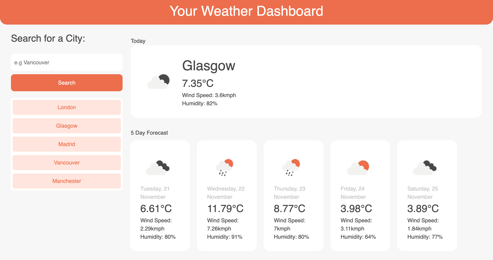

# A Weather Dashboard

A weather dashboard that allows the user to search for a city and see the current weather and a 5-day forecast.

## Description
As a traveller, I want to see the weather outlook for multiple cities so that I can plan a trip accordingly.

This application allows the user to do this through the following features:

- When the user searches for a city, they are presented with current and future conditions for that city.
- The current city is added to the search history.
- The user is presented with the city name, the date, an icon representation of weather conditions, the temperature, the humidity, and the wind speed.

## Usage
The deployed application can be found [here](https://annabrisland.github.io/weather-dash).

## License
[MIT](https://choosealicense.com/licenses/mit/)
